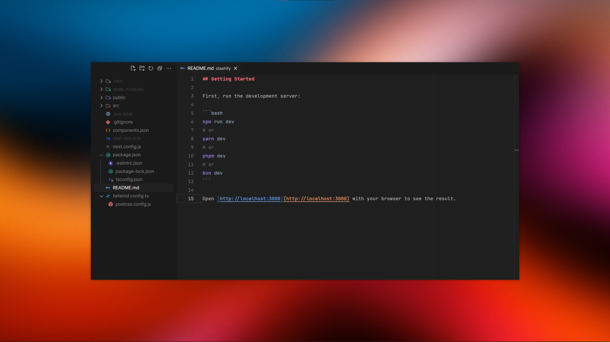

<h1 align="left">Hey 👋🏻, I'm Valentin</h1>
<h3 align="left">a junior frontend developer from Germany</h3>

 
<h5 align="left">What I'm Using:

  <a href="https://developer.mozilla.org/en-US/docs/Web/JavaScript" target="_blank" rel="noreferrer">   

 

<h5 align="left">
My VSCode Setup:
</h6>

- Configs:
- - [My settings.json](VSCode/settings.json)
- Extensions:
- - [Symbols Extension](https://marketplace.visualstudio.com/items?itemName=miguelsolorio.symbols)

- - [Min Theme Extension](https://marketplace.visualstudio.com/items?itemName=miguelsolorio.min-theme)

- - [Apc Customize UI++ Extenion](https://marketplace.visualstudio.com/items?itemName=drcika.apc-extension)
- Fonts:
- - [JetBrains Mono Font](https://www.jetbrains.com/de-de/lp/mono/)

- - [Inter Font](https://fonts.google.com/specimen/Inter)
- Wallpaper:
- - [Autumn Gradients](https://basicappleguy.com/basicappleblog/autumn-gradients)

 

